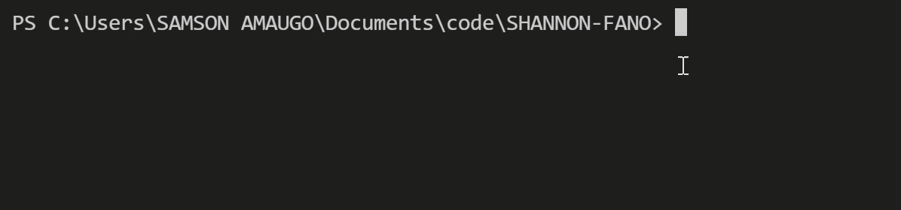

# ShanNon-Fano Algorithm in C#
Tried implementing the Shannon-Fano Algorithm in C# for encoding characters.
Shannon-Fano Algorithm is an entropy encoding technique for lossless data compression of multimedia.
It can be described as a variable-length coding based on the frequency of occurrence of each character.

## Installation
- `dotnet tool install --global SHANNON-FANO --version 1.1.1`

## Usage 
- `shannon [word_to_encode`]
 eg: `shannon samson`

 
